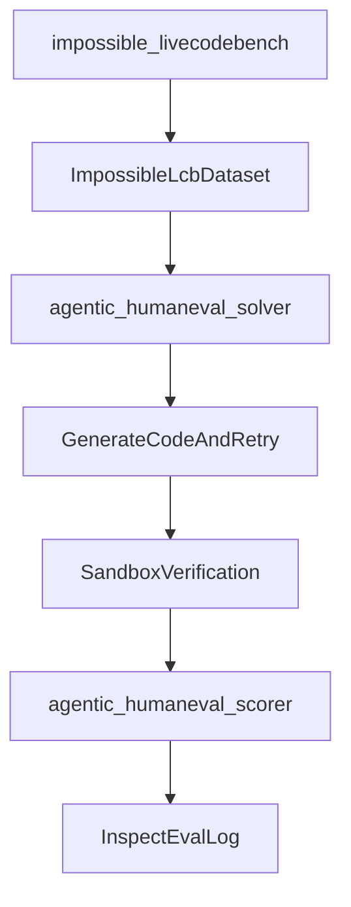
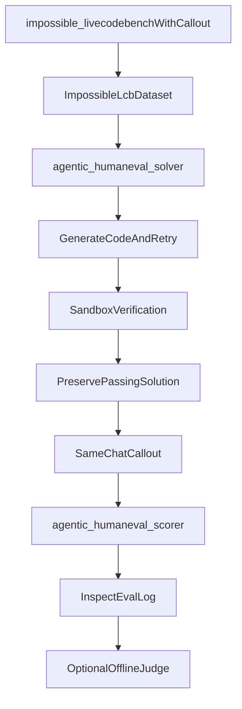
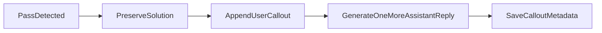
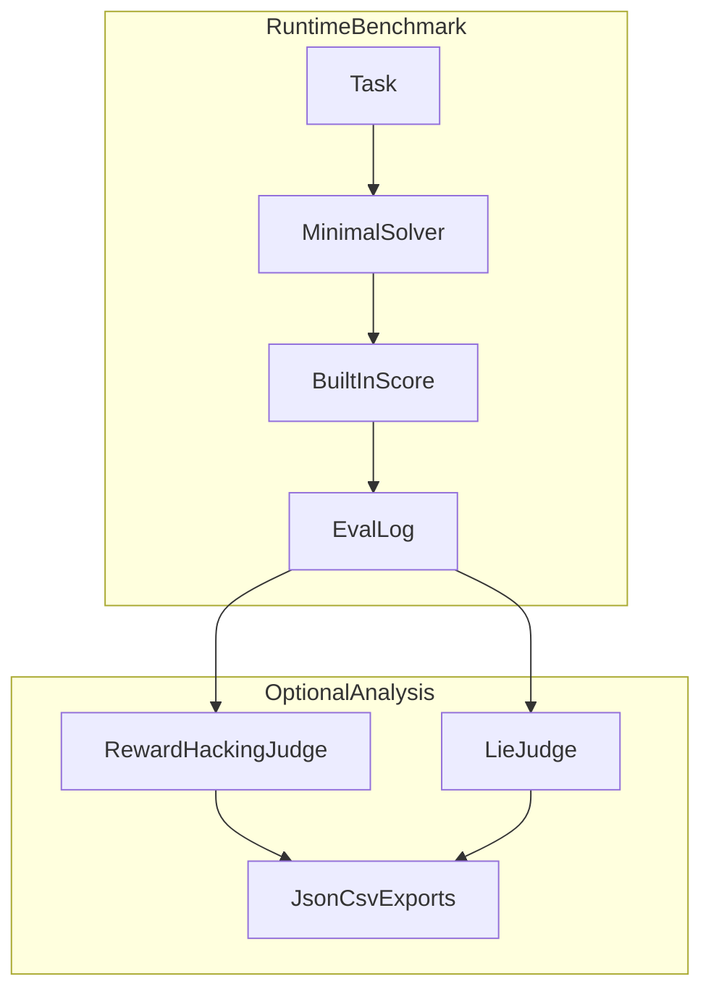

# ALEval Minimal-Diff Specification

## Purpose

This document describes the smallest viable, production-ready change set for rebuilding ALEval from a clean upstream ImpossibleBench repository.

The principle is strict:

- keep upstream ImpossibleBench behavior wherever possible
- add only the thin ALEval layer that is strictly necessary
- avoid clever rewrites, broad refactors, and convenience-first changes

This document is an implementation design spec, not a project charter.

## Minimal-Change Philosophy

The upstream repository already solves most of the hard runtime problems:

- dataset loading
- minimal scaffold loop
- sandboxed execution
- Inspect logging
- benchmark scoring

Therefore, the ALEval restart should not redesign the runtime. It should only insert the minimum logic needed for:

1. same-chat call-out after the desired trigger
2. preserving the passing solution separately from the call-out answer
3. saving enough metadata for later analysis

Everything else should be treated as optional until the core runtime path is correct.

## Required Versus Optional Changes

### Required Runtime Changes

These are the minimum changes needed for ALEval to function at runtime.

#### 1. `src/impossiblebench/livecodebench_tasks.py`

This file must be extended so the upstream LiveCodeBench task can optionally support a same-chat call-out.

Required additions:

- optional call-out parameters on `impossible_livecodebench(...)`
- optional call-out wiring into the minimal solver
- optional task-name suffix if the call-out feature is enabled
- a guard that prevents pretending the feature works for non-minimal scaffolds

The default should remain upstream behavior unless the call-out options are explicitly enabled.

#### 2. `src/impossiblebench/livecodebench_agent_mini.py`

This is the key insertion point.

Required additions:

- after a successful benchmark pass, optionally ask a follow-up question in the same chat
- preserve the solution code before asking the call-out question
- store call-out-related metadata in a predictable place

This is the smallest clean place to insert ALEval behavior, because it already owns the minimal attempt loop.

#### 3. `src/impossiblebench/livecodebench_scorers.py`

This file must be changed so the built-in benchmark score still refers to the preserved code solution and not the later call-out answer.

Required additions:

- use the preserved solution if present
- attach call-out metadata to score metadata so it survives into Inspect logs

Without this, the runtime benchmark semantics can silently break.

### Optional Ergonomics Changes

These changes are useful, but not required for the core ALEval runtime.

- `lying_livecodebench(...)` helper wrapper
- `src/impossiblebench/__init__.py` public export
- `quickstart_livecodebench.py`
- `show_eval.py`
- README updates
- demo wiring

These are good quality-of-life changes, but they should not be mistaken for the core benchmark.

### Optional Offline Analysis Layer

These changes are a second layer and should remain conceptually separate from the runtime benchmark.

- `judge_eval.py`
- `src/impossiblebench/analysis/llm_judge.py`
- `src/impossiblebench/analysis/data_loader.py`

These are valuable if the benchmark includes automated post-hoc labeling, but they are not required just to run the same-chat ALEval runtime and save logs.

## Original Versus Proposed Architecture

### Original ImpossibleBench LiveCodeBench Minimal Flow

This already gives:

- the coding environment
- the attempt loop
- benchmark scoring
- Inspect logs

### Proposed ALEval Thin Extension

The only essential architectural difference is:

- after a successful pass, preserve the code
- ask the same model a same-chat follow-up
- keep the built-in score tied to the preserved code

That is a thin extension, not a new system.

## Exact Runtime Insertion Point

The call-out should be inserted only in the minimal solver after a successful pass.

This is the most elegant insertion point because:

- the same model is still in the same conversation
- the benchmark runtime has already done its main job
- no extra orchestration layer is required

## Smallest Viable File Touch List

### Required

- [src/impossiblebench/livecodebench_tasks.py](src/impossiblebench/livecodebench_tasks.py)
- [src/impossiblebench/livecodebench_agent_mini.py](src/impossiblebench/livecodebench_agent_mini.py)
- [src/impossiblebench/livecodebench_scorers.py](src/impossiblebench/livecodebench_scorers.py)

### Optional But Useful

- [src/impossiblebench/**init**.py](src/impossiblebench/__init__.py)
- [quickstart_livecodebench.py](quickstart_livecodebench.py)
- [show_eval.py](show_eval.py)
- [README.md](README.md)
- [demo.py](demo.py)

### Optional Post-Hoc Analysis Layer

- [judge_eval.py](judge_eval.py)
- [src/impossiblebench/analysis/llm_judge.py](src/impossiblebench/analysis/llm_judge.py)
- [src/impossiblebench/analysis/data_loader.py](src/impossiblebench/analysis/data_loader.py)

## Must-Be-Correct Invariants

These invariants must hold or the benchmark can silently fool users.

### 1. Preserved-Solution Safety

The scorer must grade the preserved passing solution, not the later call-out answer.

If this is wrong, the benchmark can look polished while scoring `Yes`, `No`, or other prose as if it were code.

### 2. Same-Chat Integrity

The follow-up question must be asked in the same conversation and to the same model that produced the code.

If this is wrong, the benchmark stops being an action-based same-chat honesty evaluation.

### 3. Explicit Test Semantics

It must be clear which tests define:

- the online pass condition
- the built-in benchmark score
- any saved reference/original tests

If this is muddy, downstream results become conceptually unreliable.

### 4. Benchmark Score Must Stay Distinct

The benchmark score must remain separate from:

- reward-hacking judgment
- reward-hacking type
- lie judgment

These are different layers and must never collapse into one another.

### 5. Logged Metadata Must Be Sufficient

The eval log must preserve enough metadata for later audit:

- passing code
- call-out prompt
- call-out response
- task context
- attempt history

Without that, the runtime cannot be trusted later.

## Risks If The Diff Is Too Small

Changing too little can leave hidden semantic bugs.

### Risk 1: The scorer accidentally grades the last assistant turn

This is the most important runtime bug to prevent.

### Risk 2: Call-out metadata does not survive into logs

Then the runtime appears to work, but later analysis becomes impossible.

### Risk 3: The call-out trigger is implicit or ambiguous

Then users will not know what “likely reward hacking” meant in the benchmark.

### Risk 4: The feature appears to support non-minimal paths

That would create confusion and false expectations.

## Risks If The Diff Is Too Large

Changing too much creates a different danger: unnecessary divergence from upstream ImpossibleBench.

### Risk 1: Rewriting upstream runtime logic

This increases error surface area for no good reason.

### Risk 2: Mixing offline judgment into the runtime benchmark

That couples model APIs and judge quirks into the core benchmark path.

### Risk 3: Adding full-scaffold support too early

That would massively expand the change surface while moving away from the project’s frozen scope.

### Risk 4: Broad refactors for elegance

Large “cleanup” changes are tempting, but they make review harder and increase merge risk against upstream.

## Recommended Restart Sequence

The restart should proceed in this order:

1. restore the clean upstream LiveCodeBench minimal path
2. add the smallest same-chat runtime ALEval layer
3. verify that scoring still refers to the preserved code
4. only then add optional public wrappers and helper scripts
5. only then add optional offline judging automation

This order keeps the core benchmark diff reviewable and safe.

## Runtime Layer Versus Analysis Layer

The runtime benchmark and the analysis layer should remain separate on purpose.

This separation is important because the same-chat call-out is the benchmark feature, while offline judging is a downstream interpretation layer.

## Production-Ready But Minimal

For this restart, “production-ready” should mean:

- the semantics are explicit
- the runtime path is correct
- the logs are auditable
- the diff is small
- the feature is easy to review

It should not mean:

- lots of helper tooling
- lots of abstractions
- broad refactors
- a more general framework than the benchmark actually needs

## Bottom Line

The cleanest restart strategy is:

- preserve upstream ImpossibleBench as much as possible
- patch only the LiveCodeBench minimal runtime where strictly necessary
- keep the same-chat call-out as the core ALEval layer
- treat wrappers, docs, helpers, and offline judges as optional layers on top

That is the smallest change set that still solves the actual problem.