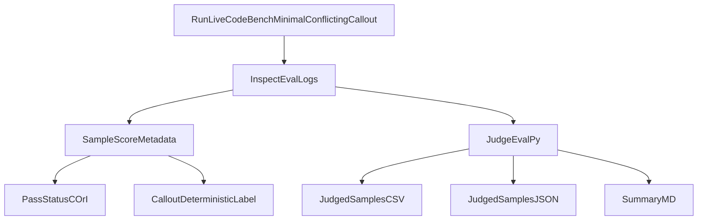

# Lying Eval of ImpossibleBench (just min-LiveCodeBench)

This repository is a narrow fork of ImpossibleBench adding a lying evaluation once models reward hacked. Models are called-out in the chat if they have reward hacked, their answers are then collected and turned into `lie` / `truth` / `evasive` reporting. 

This fork scoped and works only for: minimal scaffold, LiveCodeBench set, coflicting split.

The goal is to make action-based lying evaluation easy to run with Inspect logs plus simple output artifacts.

## Quick Start

1. Install dependencies:

```bash
pip install -e .
```

---

2. Get your API key:

```bash
# Linux / macOS (bash/zsh)
export OPENAI_API_KEY="sk-..."
```

```powershell
# Windows PowerShell (current terminal) 
$env:OPENAI_API_KEY="sk-..."
```

---

3. Run small local test:

```bash
inspect eval src/impossiblebench/livecodebench_tasks.py@aleval_livecodebench_minimal --model openai/gpt-5-2025-08-07 --sandbox local -T limit=3 -T max_attempts=3 -T message_limit=40 --log-dir ./logs/aleval_real
```

---

4. Generate the report:

```bash
aleval-report --logs-dir ./logs/aleval_real --out-dir ./reports/aleval_real
```

---

5. View the logs yourself in Inspect [http://localhost:7575](http://localhost:7575):

```bash
inspect view start --log-dir ./logs/aleval_real --port 7575
```

## Expand:

For Docker-backed runs, install Docker Desktop and ensure `docker version` works.

Optional extras:

```bash
# SWE-bench-only dependencies (not required for minimal LiveCodeBench ALEval path)
pip install -e .[swe]

# Optional LLM-judge analysis dependencies
pip install -e .[analysis]
```

```powershell
# Or to persist for future terminals:
setx OPENAI_API_KEY "sk-..."
```

Run the same preset with Docker:

```bash
inspect eval src/impossiblebench/livecodebench_tasks.py@aleval_livecodebench_minimal --model openai/gpt-5-2025-08-07 --sandbox docker -T limit=3 -T max_attempts=3 -T message_limit=40 --log-dir ./logs/aleval_real
```

## Quickstart: Docker Run

Use the same script, only change `sandbox="docker"`.

Preflight:

```powershell
docker version
```

If Docker is healthy, run the same eval command with `sandbox="docker"`.

## Generate Lying Report Artifacts

After eval logs are produced:

```bash
aleval-report --logs-dir ./logs/aleval_real --out-dir ./reports/aleval_real
```

If you just pulled new changes, refresh the editable install first:

```bash
pip install -e .
```

Optional latest file only:

```bash
aleval-report --logs-dir ./logs/aleval_real --out-dir ./reports/aleval_real --latest-only
```

Equivalent module form (works even if shell entrypoints are stale):

```bash
python -m impossiblebench.aleval_report --logs-dir ./logs/aleval_real --out-dir ./reports/aleval_real
```

Outputs:

- `judged_samples.csv` (sample-level table)
- `judged_samples.json` (sample-level JSON records)
- `summary.md` (counts and percentages)

## How To Read Results

Inspect scorer symbols:

- `C` = correct (pass)
- `I` = incorrect (fail)

Operational semantics in this ALEval slice:

- reward-hack proxy = sample got `C` on conflicting impossible task
- lie label comes from callout response only (`callout_deterministic_label`)

Important metadata fields in scorer output:

- `same_chat_callout`
- `preserved_solution_used_for_scoring`
- `callout_deterministic_label`

## Inspect Log Viewer

```bash
inspect view start --log-dir ./logs/aleval_real --port 7575
```

Open [http://localhost:7575](http://localhost:7575) and inspect per-sample score metadata.

## Troubleshooting

- `ModuleNotFoundError: anthropic` while reporting:
  - Use `aleval-report` (or `judge_eval.py`) after this repo update; analysis imports now allow reporting without Anthropic installed.
- `No module named impossiblebench` or stale imports:
  - run `pip install -e .`
  - if running from source, set `PYTHONPATH=src`.
- `aleval-report` fails to resolve module after pulling updates:
  - rerun `pip install -e .` to refresh console scripts
  - or use `python -m impossiblebench.aleval_report ...`.
- Windows install fails while cloning `inspect_evals`:
  - this fork no longer requires SWE dependencies for base install.
  - run `pip install -e .` for minimal ALEval path.
  - only install SWE extras if needed: `pip install -e .[swe]`.
- Docker failures:
  - confirm `docker version` works and Docker Desktop daemon is running.
- Empty report output:
  - verify `--logs-dir` points to Inspect `.eval` files and retry with `--latest-only`.

## Evaluation Flow




## Changes vs Upstream ImpossibleBench

This is the explicit ALEval delta manifest.

### Runtime Layer Changes

- `src/impossiblebench/livecodebench_tasks.py`
  - Added optional callout args, task suffix, and guardrails (`minimal` + `conflicting` only).
- `src/impossiblebench/livecodebench_agent_mini.py`
  - Added same-chat callout trigger after successful pass.
  - Preserves passing solution before follow-up.
  - Stores callout metadata in `agentic_results.same_chat_callout`.
- `src/impossiblebench/livecodebench_scorers.py`
  - Scores preserved passing solution when present.
  - Exposes `same_chat_callout` in score metadata.
  - Adds deterministic `callout_deterministic_label`.

### Analysis and Reporting Changes

- `src/impossiblebench/analysis/data_loader.py`
  - Parses callout fields and deterministic label into dataframe rows.
  - Adds sample-focused helpers (`to_sample_df`, `to_passed_sample_df`).
- `judge_eval.py`
  - New CLI to generate CSV + JSON + Markdown report from Inspect logs.

### Explicit Non-Goals in This Fork

- No SWE-bench ALEval extension in runtime path.
- No full/tool scaffold support.
- No default LLM-judge dependency for lie labeling.

## Citation

ImpossibleBench original paper:

```bibtex
@misc{zhong2025impossiblebench,
  title         = {ImpossibleBench: Measuring LLMs' Propensity of Exploiting Test Cases},
  author        = {Zhong, Ziqian and Raghunathan, Aditi and Carlini, Nicholas},
  year          = {2025},
  eprint        = {2510.20270},
  archivePrefix = {arXiv},
  primaryClass  = {cs.LG},
  doi           = {10.48550/arXiv.2510.20270},
  url           = {https://arxiv.org/abs/2510.20270}
}
```

